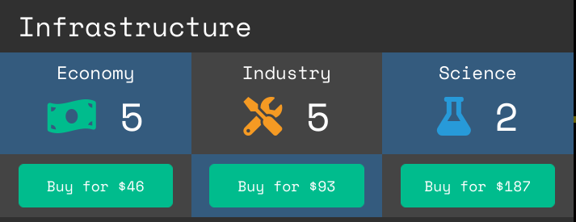

Infrastructure

There are 3 types of infrastructure that can be built at stars:

    Economy - Increases income at production, each point of Economy earns 10 credits on the production tick.
    
    Industry - Increases ship production rate.

    Science - Increases research speed. Each point of Science will generate one research point per tick for the chosen current technology that is being researched.

