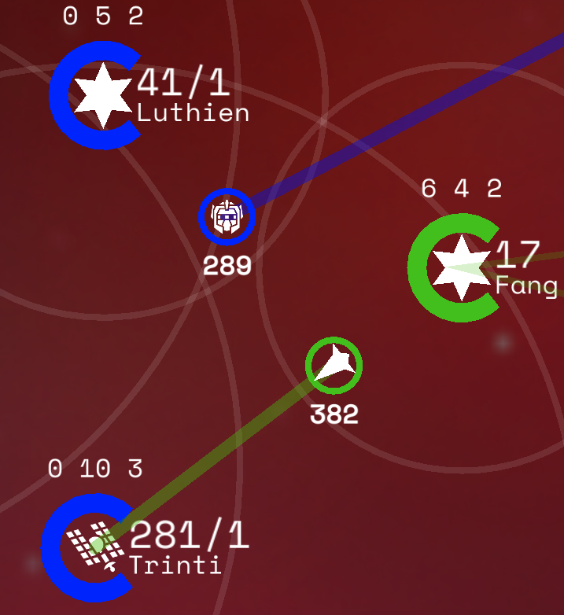

# Carriers
Carriers are used to transport Ships through hyperspace to reach other Stars. They can only be built at Stars and must hold a minimum of 1 Ship.

Carriers are displayed as small ship icons with a circular coloured halo, much like stars. The number of ships that a carrier has will be displayed when zoomed in. Click on the carrier to view it in detail.

