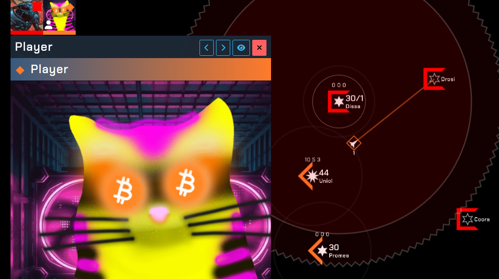

# What is this ?

**Dark Forest RGB** is a slow paced browser game based on diplomacy, strategy and intrigue. To win the game, you must capture stars.

You will not be alone, other players will also be trying to achieve the same goal. You must build diplomatic relations with other players to create alliances, trade agreements and possibly even subterfuge to backstab your allies and claim victory.

The galaxy contains stars that can be upgraded and will build ships for carriers that will traverse across the galaxy in order to capture unclaimed stars or fight other players to capture theirs.

# ROAD MAP

## 1. Play to earn whitelist

We will release the initial version, and invited players can enter the Dark Forest world.

Here you will fight against the AI. Each player initially has 1 capital star and 1 subsidiary star, and the same goes for the AI.
You need to build carriers and ships to capture as many stars as possible. But this requires resources. Spending money to upgrade economy, industry and science will increase your development speed.

It's beta, just have fun. Some whitelists will be given to participants.

## 2. Migrate to RGB On-Chain Game

The beta version will be fully deployed by the web2 technology stack, and once the RGB related protocols are perfected, we will migrate to on-chain games.

We will build games like this:

- With each token, any community can open its own game world. You only need to create a game and then invite community partners to join the competition. Participants need to pay a small amount of Bitcoin and community tokens, like PPRGB.

- RGB NFT projects will be able to enter the game world as game avatars. The community system and chat system will allow you to get closer to the fun of the community in the game.

- The laws of the Dark Forest will support the game: Survival is the first principle.igrate to RGB On-Chain Game Everyone needs to develop. When you develop to a certain stage, you can find traces of others, and you can decide whether to establish diplomacy, attack, or become invisible. You monitor others, but you are also monitored by others. Attacks and diplomacy may expose your position, but you have to make choices in order to develop. Whoever wins the game will own the rewards of the entire universe (30% for community, 40% for winner, 30% for burn address). You will win 10,000$ per game and bring activity and funds to the community.

- Another features......

## 3. PassPort 

Higher adoption will bring positive benefits and we will work with all RGB protocols. Passport will determine the initial voting power of the community (why initial? Because we will eventually open source the entire game, which is an interesting experiment). Passport holders will receive dividends from the game’s initial earnings in the future, or redeem them at the original price after locking up.

## 4. Autonomous world

