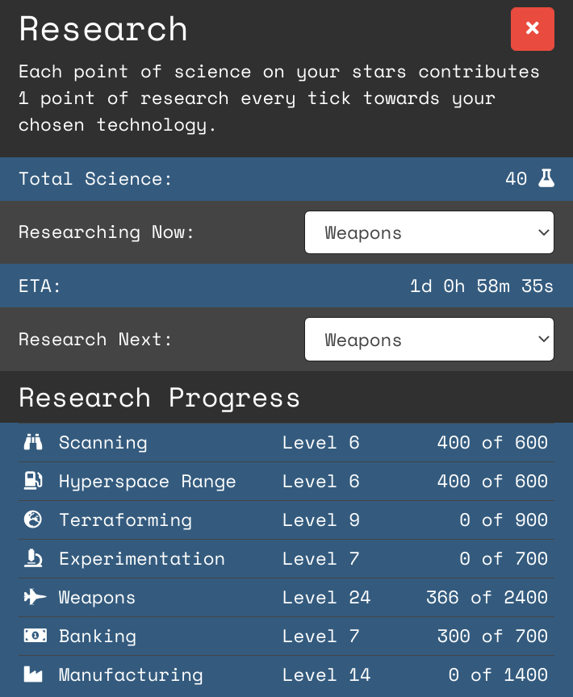

# Science & Technology
Science infrastructure built at Stars contribute to the overall research amount per tick for the chosen technology that is being researched. More Science infrastructure increases the speed of which new technology is researched.

Open the Research screen to view the current research and set the next research.

The types of technologies are as follows:

