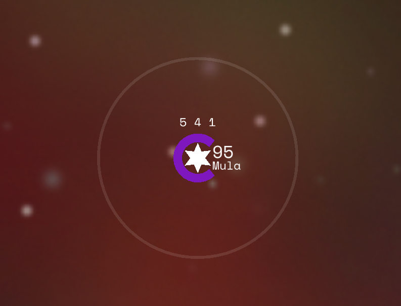

# Stars
Stars are the key to victory in Solaris, capture the most stars to win!

Stars are displayed as star shaped icons with a circular halo denoating which player the star belongs to by colour. When zoomed in the star will display garrison and how many carriers are orbiting the star (if any) followed by the star’s name. Above the star there will be 3 numbers, these represent the star’s Economy, Industry and Science infrastructure respectively. Click on the star to view it in detail.

