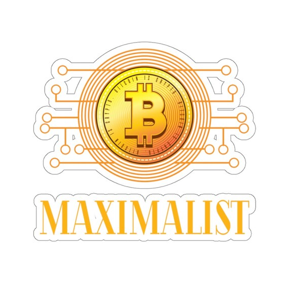

WEB3 is a high-speed train with endless new concepts and rapid capital flow.

There is no shortage of bright and talented people launching a large number of projects, but the problem is:

- Too many projects, too few use cases
- Too many shitcoins, but what we need is a place to use coins

Most projects are eager to release their assets, but we are committed to providing practical scenarios for RGB projects.

This is what we will focus on:

- Community
- Game

We will collaborate with NFT/meme/infra projects to provide them with community services and integrate their NFTs and tokens into the game.

Last but not least, Bitcoin maximalism.

₿₿₿₿₿₿₿₿₿₿₿₿₿₿RG₿₿₿₿₿₿₿₿₿₿₿₿₿₿₿₿₿
